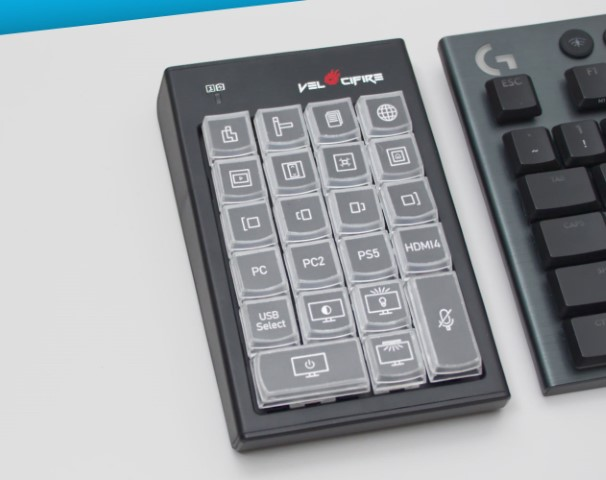
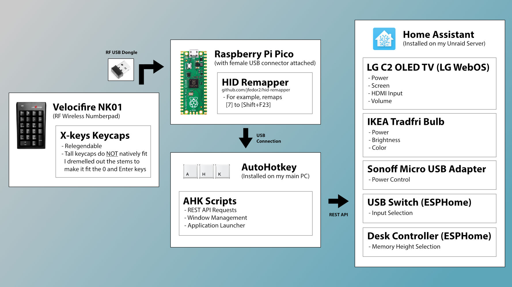

# desk-controller

This keypad controls my entire desk setup. Everything from the LG OLED TV, USB Switch, Monitor Lights, and even the Standing Desk is controlled with this keypad.

You can see a demonstration of the controller on YouTube: [How I Automated my Desk Setup](https://youtu.be/DTJSREjWH7Y)

This setup includes a combination Auto Hotkey, Home Assistant and ESPHome scripts in order to work. Sample code has been included in the respective folders.

